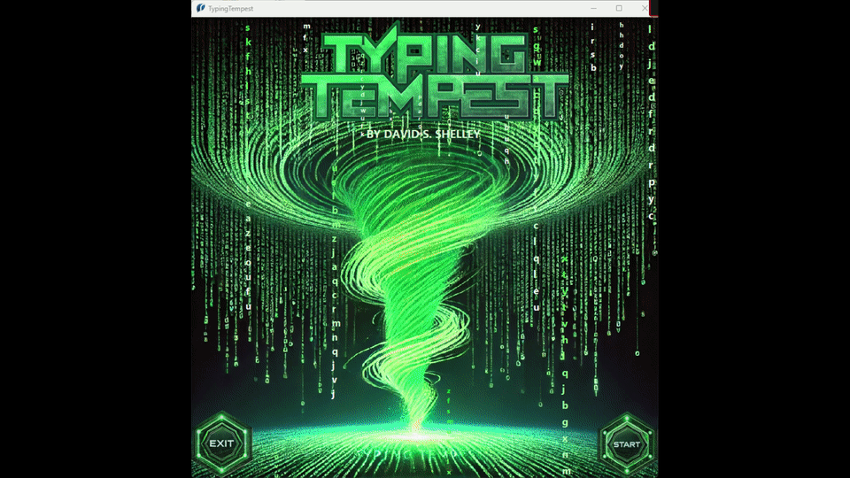

# TypingTempest
TypingTempest is an educational tool designed to give feedback when typing a sequence or code or other text.

1. Supports colored syntax for better readability normal ascii text files.  
2. Practice typing sequences that you create yourself.  
3. Utilize the backspace key to correct any mistyped sequences.

  
