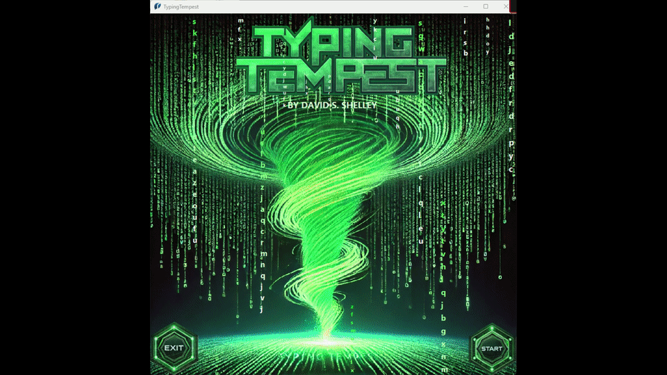

# TypingTempest

TypingTempest is a typing practice application focused on helping users improve accuracy and speed while typing source code or custom text passages.

Originally developed as a prototype in LiveCode, TypingTempest has been rewritten in **C#** as a Windows desktop application with enhanced editing, syntax highlighting, and speech features.

## Features

- Practice typing source code, scripts, or custom text content
- Real-time feedback while typing
- Syntax highlighting for improved readability
- Backspace support for correcting mistakes
- Lesson-based practice content
- Speech/audio cues for accessibility and learning support
- Modern Windows desktop experience built with C#

## Technology

TypingTempest is developed in **C#** using the .NET platform.

## Third-Party Libraries

This project uses the following MIT-licensed packages:

### AvalonEdit  
Text editor component used for syntax highlighting and code editing.

- Authors: AvalonEdit Contributors  
- License: MIT  
- Project URL: http://avalonedit.net/

### System.Speech

Speech synthesis functionality used for audio prompts and spoken feedback.

- Authors: Microsoft  
- License: MIT  
- Project URL: https://dot.net

## Screenshot / Demo

## Purpose

TypingTempest was created as an educational tool to help users build typing fluency with programming syntax, commands, and structured text.

## License

See repository license file for details.
